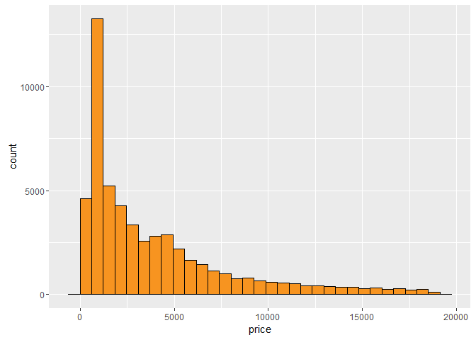
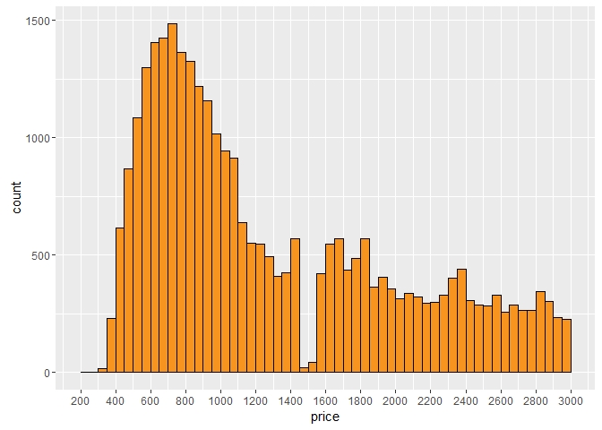
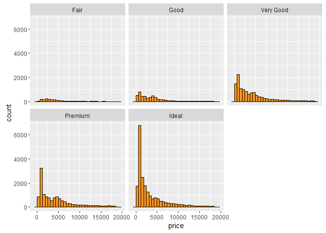
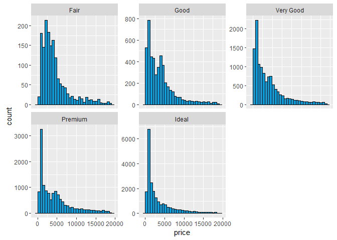
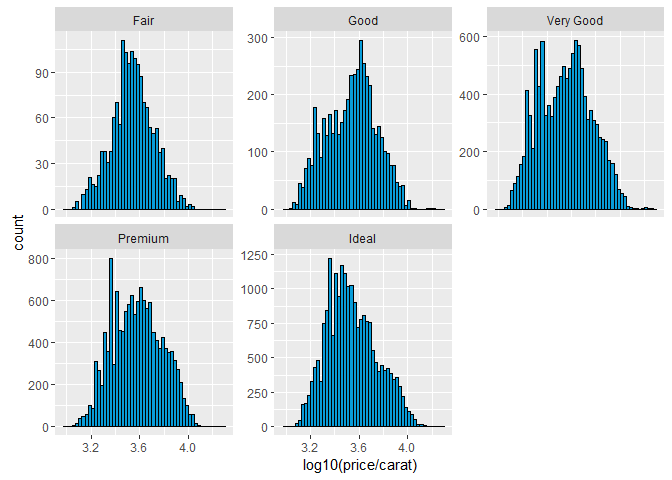
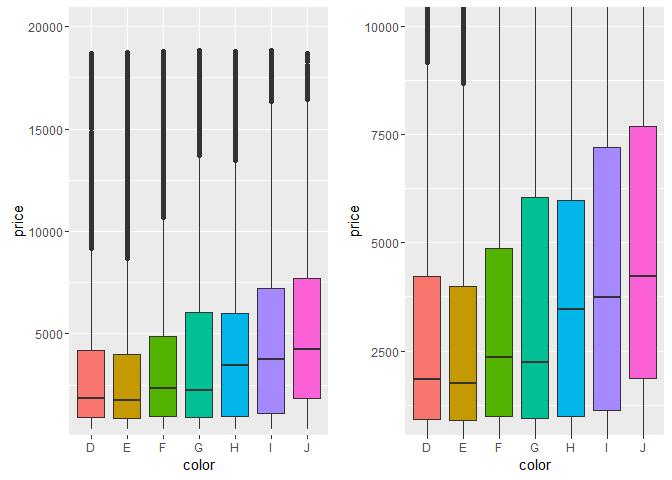
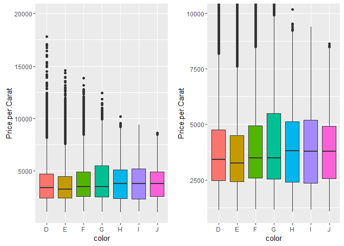
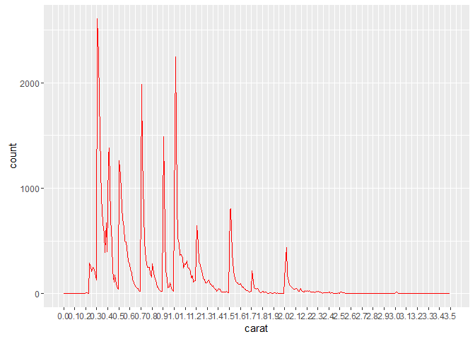

# Diamond Prices EDA Problem Set 3
Manu Kushwaha  
April 11, 2016  


```r
# Loading the required libraries
library(ggplot2)
suppressMessages(library(dplyr))
suppressMessages(library(gridExtra))
```


```r
# Loading the diamonds dataset into "d" and creating the scatterplot
d <- diamonds
```

### Q1) Diamonds
#### Questions a), b) and c) below can be addressed by the following command:


```r
str(d)
```

```
## Classes 'tbl_df', 'tbl' and 'data.frame':	53940 obs. of  10 variables:
##  $ carat  : num  0.23 0.21 0.23 0.29 0.31 0.24 0.24 0.26 0.22 0.23 ...
##  $ cut    : Ord.factor w/ 5 levels "Fair"<"Good"<..: 5 4 2 4 2 3 3 3 1 3 ...
##  $ color  : Ord.factor w/ 7 levels "D"<"E"<"F"<"G"<..: 2 2 2 6 7 7 6 5 2 5 ...
##  $ clarity: Ord.factor w/ 8 levels "I1"<"SI2"<"SI1"<..: 2 3 5 4 2 6 7 3 4 5 ...
##  $ depth  : num  61.5 59.8 56.9 62.4 63.3 62.8 62.3 61.9 65.1 59.4 ...
##  $ table  : num  55 61 65 58 58 57 57 55 61 61 ...
##  $ price  : int  326 326 327 334 335 336 336 337 337 338 ...
##  $ x      : num  3.95 3.89 4.05 4.2 4.34 3.94 3.95 4.07 3.87 4 ...
##  $ y      : num  3.98 3.84 4.07 4.23 4.35 3.96 3.98 4.11 3.78 4.05 ...
##  $ z      : num  2.43 2.31 2.31 2.63 2.75 2.48 2.47 2.53 2.49 2.39 ...
```
* a). How many observations are in the dataset?
    + Answer: 53940 observations
* b). How many variables are in the dataset?
    + Answer: 11 variables
* c). How many ordered factors are in the dataset?
    + Answer: 3 ordered factors (cut, color and clarity)
* d). what letter represents the best color for a diamond?
    + Answer: D represents the best color for a diamond

```r
# This can be done by the following command:
#?diamonds
```


***

### Q2) Price Histogram
* Create a histogram of the price of all the diamonds in the diamond data set


```r
qplot(x = price, data = d,
      color = I("black"), fill = I("#F79420"))
```

```
## `stat_bin()` using `bins = 30`. Pick better value with `binwidth`.
```

\

***

### Q3) Price Histogram Summary
* Describe the shape and the center of the price distribution. Include summary statistics like the mean and median


```r
median(d$price)
```

```
## [1] 2401
```


```r
mean(d$price)
```

```
## [1] 3932.8
```

```r
# Calculate the % of diamonds greater than the mean
nrow(subset(d,price>3932.8))/nrow(d)
```

```
## [1] 0.3644234
```

```r
# Alternatively, summary(d$price) command could also have been used, but would give rounded off figures
```

* Observations:
    + Right skewed distribution
    + The count shows that majority of the diamonds (~64%) lie below the mean price of $3932.8
    + In this case, median is a better indicator of the central tendency than mean of $3932.8 due to the large tail to the right

***

### Q4) Diamond Counts
#### Questions:
* a). How many diamonds cost less then $500?
  

```r
sum(d$price < 500)
```

```
## [1] 1729
```

* b). How many diamonds cost less than $250?


```r
sum(d$price < 250)
```

```
## [1] 0
```

* c). How many diamonds cost $15,000 or more?


```r
sum(d$price >= 15000)
```

```
## [1] 1656
```

***

### Q5) Cheaper Diamonds
* Explore the largest peak in the price histogram you created earlier
* Try limiting the x-axis, altering the bin width, and setting different breaks on the x-axis


```r
qplot(x = price, data = d,
      binwidth = 50,
      color = I("black"), fill = I("#F79420")) +
  scale_x_continuous(breaks = seq(200,3000,200), limits = c(200,3000))
```

```
## Warning: Removed 23604 rows containing non-finite values (stat_bin).
```

```
## Warning: Removed 2 rows containing missing values (geom_bar).
```

\

***

### Q6) Price by Cut Histograms
* Break out the histogram of diamond prices by cut
* You should have five histograms in separate panels on your resulting plot


```r
qplot(x = price, data = d,color = I("black"), fill = I("#F79420")) + 
  facet_wrap(~cut)
```

```
## `stat_bin()` using `bins = 30`. Pick better value with `binwidth`.
```

\

#### Do you think the distributions look the same or different?
* The distributions all appear to be right skewed with long tails with greater number of diamonds at the lower price segment

***

### Q7) Price by Cut
* Anwser the questions below. Check more than one option if there are ties


```r
d %>% 
  group_by(cut) %>% 
  summarise(max_price = max(price),
            min_price = min(price),
            median_price = median(price)) %>% 
  arrange(desc(max_price))
```

```
## Source: local data frame [5 x 4]
## 
##         cut max_price min_price median_price
##      (fctr)     (int)     (int)        (dbl)
## 1   Premium     18823       326       3185.0
## 2 Very Good     18818       336       2648.0
## 3     Ideal     18806       326       1810.0
## 4      Good     18788       327       3050.5
## 5      Fair     18574       337       3282.0
```


Questions                                   | Fair  | Good  | Very Good | Premium | Ideal |
--------------------------------------------|-------|-------|-----------|:-------:|:-----:|
a) Which cut has the highest priced diamond?|       |       |           |    Y    |       |
b) Which cut has the lowest priced diamond? |       |       |           |    Y    |   Y   |
c) Which cut has the lowest median price?   |       |       |           |         |   Y   |

***

### Q8) Scales and Multiple Histograms
* Look up the documentation for facet_wrap in R Studio 
* Then, scroll back up and add a parameter to facet_wrap so that the y-axis in the histograms is not fixed. You want the y-axis to be different for each histogram


```r
qplot(x = price, data = d,
      color = I('black'), fill = I('#099DD9')) + 
  facet_wrap(~cut, scales = "free_y")
```

```
## `stat_bin()` using `bins = 30`. Pick better value with `binwidth`.
```

\

***

### Q9) Price per Carat by Cut

* Create a histogram of price per carat and facet it by cut
* You can make adjustments to the code from the previous exercise to get started
* Adjust the bin width and transform the scale of the x-axis using log10


```r
qplot(x = log10(price/carat), data = d, 
      binwidth = 0.025,
      color = I('black'), fill = I('#099DD9')) + 
  facet_wrap(~cut, scales = "free_y")
```

\


***

### Q10) Price Box Plots

* Investigate the price of diamonds using box plots, numerical summaries, and one of the following categorical variables: cut, clarity, or color

* Creating 2 box plots for Price vs color with varying y-axis

```r
p1 <- qplot(x = color, y = price,
      data = d,
      geom = "boxplot",
      fill = color) +
  theme(legend.position = "none") +
  coord_cartesian(ylim = c(1000, 20000))
  
p2 <- qplot(x = color, y = price,
      data = d,
      geom = "boxplot",
      fill = color) +
  theme(legend.position = "none") +
  coord_cartesian(ylim = c(1000, 10000))

grid.arrange(p1, p2, ncol = 2)
```

\

* Creating a summary of Price by color

```r
by(d$price, d$color, summary)
```

```
## d$color: D
##    Min. 1st Qu.  Median    Mean 3rd Qu.    Max. 
##     357     911    1838    3170    4214   18690 
## -------------------------------------------------------- 
## d$color: E
##    Min. 1st Qu.  Median    Mean 3rd Qu.    Max. 
##     326     882    1739    3077    4003   18730 
## -------------------------------------------------------- 
## d$color: F
##    Min. 1st Qu.  Median    Mean 3rd Qu.    Max. 
##     342     982    2344    3725    4868   18790 
## -------------------------------------------------------- 
## d$color: G
##    Min. 1st Qu.  Median    Mean 3rd Qu.    Max. 
##     354     931    2242    3999    6048   18820 
## -------------------------------------------------------- 
## d$color: H
##    Min. 1st Qu.  Median    Mean 3rd Qu.    Max. 
##     337     984    3460    4487    5980   18800 
## -------------------------------------------------------- 
## d$color: I
##    Min. 1st Qu.  Median    Mean 3rd Qu.    Max. 
##     334    1120    3730    5092    7202   18820 
## -------------------------------------------------------- 
## d$color: J
##    Min. 1st Qu.  Median    Mean 3rd Qu.    Max. 
##     335    1860    4234    5324    7695   18710
```

#### Do you see any trends or oddities in your results?

* Given facts about the "diamonds" dataset:
    + D is the "Best" color diamond
    + J is the "Worst" color diamond

* Observations from the Box Plots:
    + The oddity is that the mean price of the diamonds increases as the color gets worse
    + The variance in price of the diamonds also follows the same trend
    + The plots show that color is probably not an important factor that determines the price of the diamonds

***

### Q11) Interquartile Range - IQR
#### Questions (answers are from the summary above):
* a). What is the price range for the middle 50% of diamonds with color D?
    + First quartile (25%)? - 911
    + Third quartile (75%)? - 4214

* b). What is the price range for the middle 50% of diamonds with color J?
    + First quartile (25%)? - 1860
    + Third quartile (75%)? - 7695
  
* Questions c) and d) can be answered using the following command

```r
by(d$price, d$color, IQR)
```

```
## d$color: D
## [1] 3302.5
## -------------------------------------------------------- 
## d$color: E
## [1] 3121
## -------------------------------------------------------- 
## d$color: F
## [1] 3886.25
## -------------------------------------------------------- 
## d$color: G
## [1] 5117
## -------------------------------------------------------- 
## d$color: H
## [1] 4996.25
## -------------------------------------------------------- 
## d$color: I
## [1] 6081.25
## -------------------------------------------------------- 
## d$color: J
## [1] 5834.5
```
* c). What is the IQR for diamonds with the best color?
    + 3302.5 (color D)

* d). What is the IQR for diamonds with the worst color?
    + 5834.5 (color J)

***

### Q12) Price per Carat Box Plots by Color
* Investigate the price per carat of diamonds across the different colors of diamonds using boxplots


```r
# Defining Price per carat object
Price.per.Carat <- d$price / d$carat
```

* Creating the Price.per.Carat by Color boxplots with varying y-axis

```r
p1 <- qplot(x = color, y = Price.per.Carat,
      data = d,
      geom = "boxplot",
      fill = color) +
  theme(legend.position = "none") +
  coord_cartesian(ylim = c(1000, 20000))
  
p2 <- qplot(x = color, y = Price.per.Carat,
      data = d,
      geom = "boxplot",
      fill = color) +
  theme(legend.position = "none") +
  coord_cartesian(ylim = c(1000, 10000))

grid.arrange(p1, p2, ncol = 2)
```

\

* Observations from the Box Plots:
    + There is a large number of outliers (shown by the black dots) in the chart for the 1st four colors
    + Minimal price per carat variance is noticed below the median threshold across all colors; meaning that 50% of diamonds in each color category fall within the same price range (i.e. color does not appear to be so important)  
    + A much higher price per carat variance exists across all colors over the median threshold; meaning that there might be factors other than colors that are governing the higher price per carat of these diamonds
    + Interestingly, based on the facts about the color, the expectation would be that the price per carat should be higher for diamonds of color D than those of color J, but this is clearly not the case
    + Of all colors, G stands out the most with the highest variation in price per carat above the median threshold
    + Overall, it appears that color is probably not the best factor to determine the price per carat of the diamonds, due to large variations and randomness in data and with no sense of correlation. There could be other factors that play a role in determining a closer correlation to price per carat of the diamonds

***

### Q12) Carat Frequency Polygon
* Investigate the weight of the diamonds (carat) using a frequency polygon. Use different bin widths to see how the frequency polygon changes


```r
qplot(x = carat, data = d,
      color = I("red"), 
      geom = "freqpoly", 
      binwidth = 0.01) + 
  scale_x_continuous(breaks = seq(0,3.5,0.1), limits = c(0,3.5))
```

```
## Warning: Removed 9 rows containing non-finite values (stat_bin).
```

```
## Warning: Removed 2 rows containing missing values (geom_path).
```

\

#### What carat size has a count greater than 2000?
* Answer: 0.3 and 1.01

